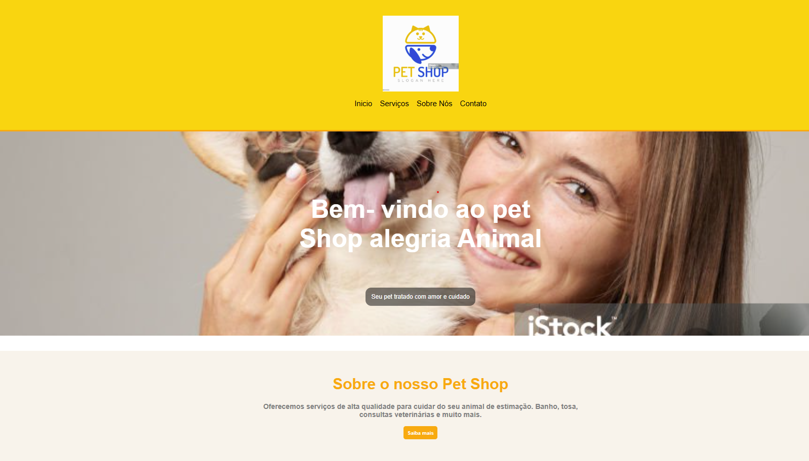
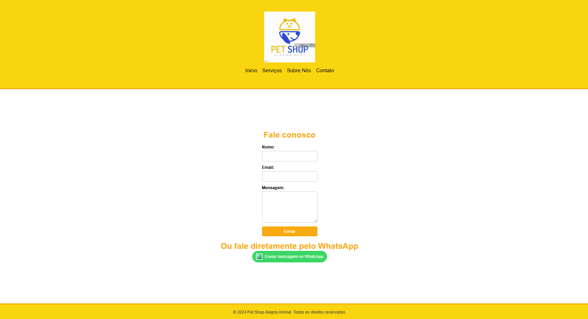

# pet-shop

# 🐶 Pet Shop Alegria Animal  

Este é um site simples e responsivo para um **Pet Shop**, criado usando **apenas HTML e CSS**.  

## 📌 Funcionalidades  
- Página inicial com informações sobre o pet shop.  
- Seção de serviços oferecidos.  
- Página "Sobre Nós" com detalhes da empresa.    

## 🛠️ Tecnologias Utilizadas  
- **HTML5** para a estrutura do site.  
- **CSS3** para estilização e layout.  

## 🚀 Como Executar  
1. Faça o download dos arquivos ou clone este repositório.  
2. Abra o arquivo **petshop.html** em qualquer navegador.  

📩 Em caso de dúvidas ou sugestões, entre em contato. 🐾 
 

 

 
